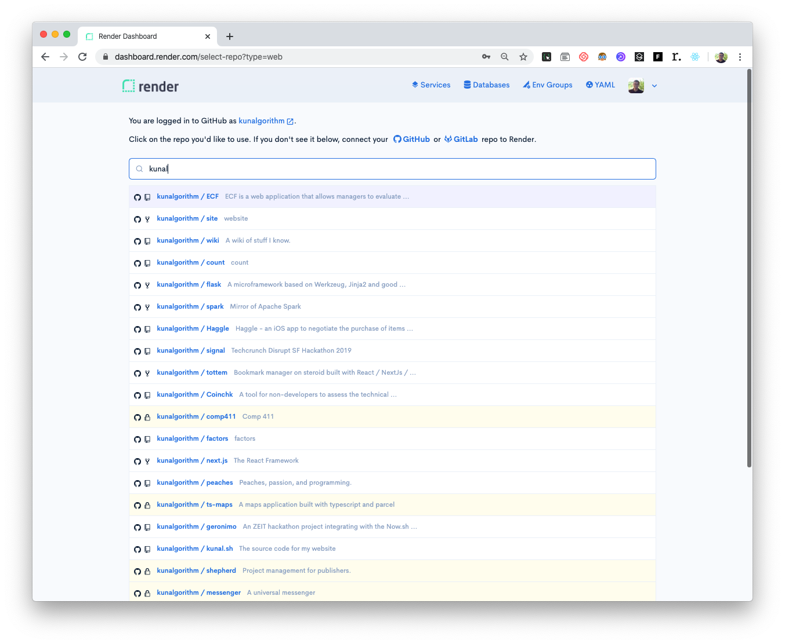

> How to deploy your frontend/backend/fullstack app on [render](https://render.com), fire up a postgres database, and connect to it. 

First, Fork or prepare your repo of choice and make sure the production build runs locally. 

Log into [render](https://render.com) with your github account. Head to the [dashboard](https://dashboard.render.com/services) and click on "New Web Service". 

<!--  -->

Once you've granted Render permission to access some or all of your repos, you should see a list to choose from.

## Create a postgres database 
Currently, render only supports postgres databases. 

